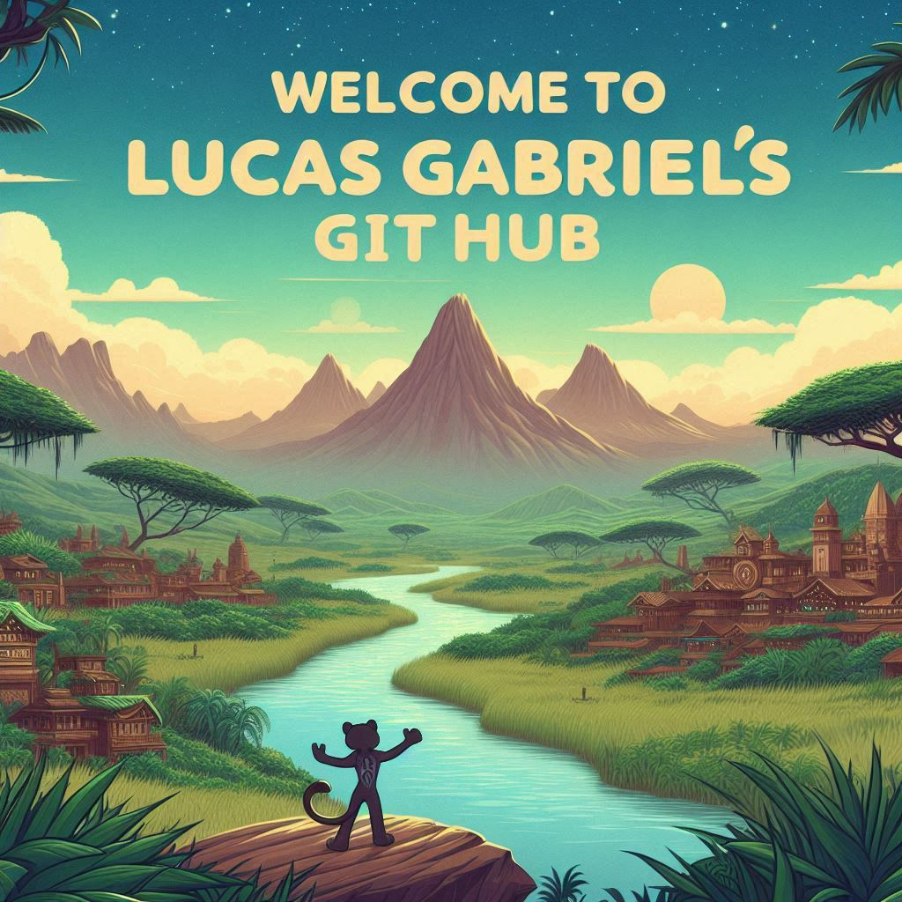

# Bem-vindo ao GitHub do Lucas Gabriel! 👋

## Sobre mim
- 🎓 **Estudante de:** Análise e Desenvolvimento de Sistemas (ADS) no Instituto Federal de Santa Catarina (IFSC).
- 📚 **Fase Atual:** Estou na 2ª fase do curso, explorando conceitos fundamentais de programação, banco de dados e desenvolvimento web.
- 🌟 **Projetos em andamento:** Desenvolvimento web e automação.
- 🤝 **Colaboração:** Aberto para projetos de impacto e aprendizado.
- ⚡ **Fato divertido:** Sou fascinado por tecnologias futurísticas e pelo mundo Marvel (Wakanda Forever!).

## Tecnologias e Ferramentas 💻

## Redes Sociais 🌐
Conecte-se comigo:

---

---

<picture align="center">     
  <source media="(prefers-color-scheme: dark)" srcset="https://raw.githubusercontent.com/victorlcrd/victorlcrd/output/github-contribution-grid-snake-dark.svg">
  <source media="(prefers-color-scheme: light)" srcset="https://raw.githubusercontent.com/victorlcrd/victorlcrd/output/github-contribution-grid-snake-dark.svg">
  
</picture>

##
## 🔗 Repositórios Destacados

